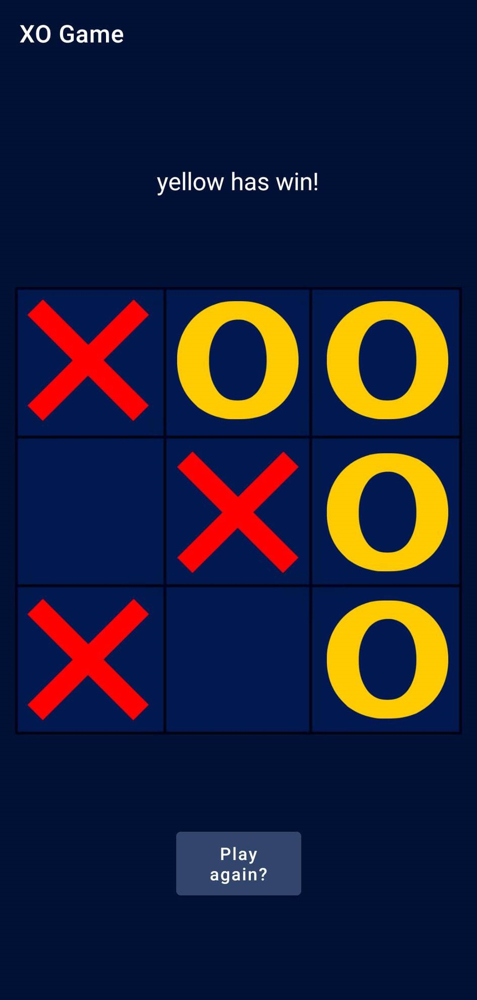
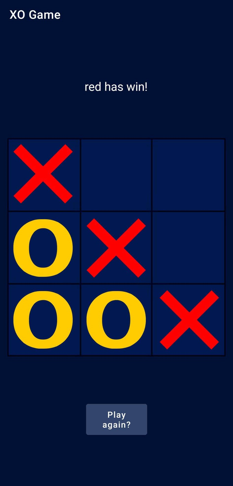

# XO-Game
How to play:
 
Press on any cell from the nine cells and then the next player press on another cell.
To win the Game you you should make three in row or in colume or in diagonal same X or O 
  

   

  

